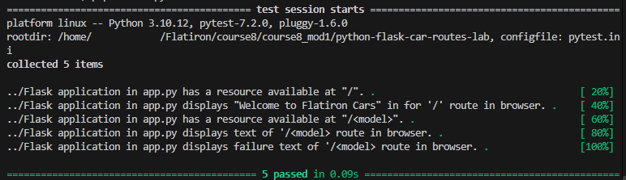

````markdown
# Python Flask Car Routes Lab

## Description

This project is a Flask application that demonstrates how to create and use routes in Python with Flask.

The application includes a home route that displays a welcome message and a dynamic route that accepts a car model as part of the URL. The application checks the requested model against a list of available vehicles and returns a message indicating whether the model exists in the fleet.

## Technologies Used

- Python
- Flask
- Werkzeug
- Pipenv
- pytest

## Project Structure

```text
python-flask-car-routes-lab/
├── .pytest_cache/
├── .vscode/
├── screenshots/
│   └── screenshot.png
├── server/
│   ├── testing/
│   │   ├── app_test.py
│   │   └── conftest.py
│   └── app.py
├── CONTRIBUTING.md
├── LICENSE.md
├── Pipfile
├── Pipfile.lock
├── pytest.ini
└── README.md
```

## Installation

Clone the repository and navigate into the project directory.

Install the dependencies from the Pipfile:

```bash
pipenv install
```

Enter the Pipenv virtual environment:

```bash
pipenv shell
```

## Running the Application

Navigate to the `server` directory:

```bash
cd server
```

Run the Flask application:

```bash
python app.py
```

The application will start the Flask development server.

Open the address displayed in the terminal in your browser to interact with the application.

## Application Routes

### Home Route

The home route is available at:

```text
/
```

Visiting the home page returns:

```text
Welcome to Flatiron Cars
```

### Car Model Route

The application also provides a dynamic route:

```text
/<model>
```

The model entered in the URL is checked against the application's list of existing models.

Available models include:

* Beedle
* Crossroads
* M2
* Panique

For example:

```text
/M2
```

returns:

```text
Flatiron M2 is in our fleet!
```

If a model does not exist in the catalog, the application returns a message indicating that the requested model was not found.

For example:

```text
/Civic
```

returns:

```text
No models called Civic exists in our catalog
```

## Running the Tests

The project uses `pytest` for testing.

From the `server` directory, run:

```bash
pytest
```

For more detailed test output:

```bash
pytest -v
```

The test suite verifies that:

* The `/` route is available.
* The `/` route displays the expected welcome message.
* The `/<model>` route is available.
* An existing model returns the appropriate fleet message.
* A model that does not exist returns the appropriate failure message.

## Example

Start the application:

```bash
python app.py
```

Then visit a model route in the browser:

```text
http://127.0.0.1:5000/Beedle
```

The application responds with:

```text
Flatiron Beedle is in our fleet!
```

## Screenshot

Add a screenshot of the running Flask application below:



## Conclusion

This lab provides practice building routes with Flask and using dynamic URL parameters. It demonstrates how Flask can capture information from a URL and use Python logic to determine the response returned to the browser.

## Author

Created by Matthew Swanberg as part of  Course 8 Module 1 (Introduction to Flask - Car Routes)

```